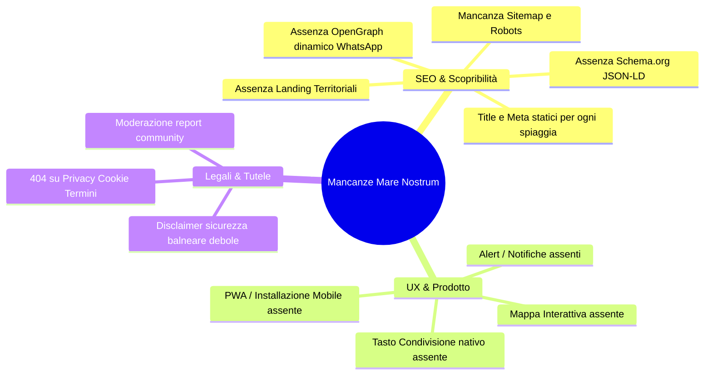
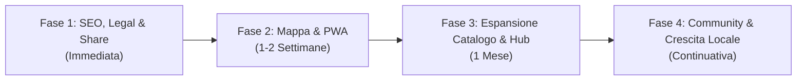

# Mare Nostrum — Audit Strategico, Tecnico e di Crescita

> **Copia storica non canonica.** Questo file è stato lasciato dall’altra
> sessione prima dei commit SEO/legal/social/PWA/mappa e conserva il contenuto
> originale per tracciabilità. Per lo stato corrente usare
> `/Users/matteo/siciliabeach/AUDIT.md` e `HANDOFF.md`; non usare le checklist
> qui sotto per decidere cosa manca.

Data di riferimento: **23 Agosto 2026**
Stato applicazione: **Live in produzione** ([marenostrum.app](https://marenostrum.app))
Worktree di riferimento: `/Users/matteo/siciliabeach/.worktrees/real-forecast-foundation`
Branch attivo: `codex/beach-info-prototypes`

---

## 1. Stato dell’Arte dell’Applicazione

Mare Nostrum è una web app mobile-first creata per aiutare residenti e turisti a scegliere la spiaggia ideale in Sicilia in base alle condizioni meteomarine in tempo reale e con previsioni a 4 giorni.

### Funzionalità Reali e Operative in Produzione
- **Previsioni Reali Multi-Fonte**: Ingestione automatizzata da **Open-Meteo** (meteo e marine) su database **Supabase** (`hivenxncleensmvvhkou`), con forecast orari a 96 ore calcolati sul fuso orario `Europe/Rome`.
- **Algoritmo di Scoring Matematico**: Punteggio da 0 a 100 per fascia oraria (*Tutto il giorno*, *Mattina*, *Pomeriggio*) calcolato su vento, raffiche, altezza onde, pioggia e copertura nuvolosa. Accesso e tag descrittivi non alterano arbitrariamente il rating.
- **UX Mobile-First**: Griglia Home compatta a 2 colonne, barra selettore data/periodo reattiva, card condizioni con dettaglio orario e accordion espandibile *"Scopri la spiaggia"* integrato nella vista di dettaglio.
- **Filtri & Geolocalizzazione**: Filtri multi-selezione (sabbia, scogli, famiglie, servizi) con logica OR intra-gruppo e AND inter-gruppo. Controllo *"Vicino a me"* con calcolo della distanza chilometrica reale via Geolocation API.
- **Segnalazioni Community Anonime**: Sistema di feedback con cookie `HttpOnly` per deduplicazione, rate limiting giornaliero e stati del mare (*Calmo*, *Mosso*, *Agitato*), alghe e affollamento.
- **Qualità del Codice e Affidabilità**: 60 file di test con **245 test passati**, TypeScript strict, Next.js 16.3.1 (App Router), React 19 e Tailwind CSS 4.

### Componenti Mock, Statici o da Completare
- **Navigazione Mobile**: I pulsanti **"Mappa"** e **"Impostazioni"** nella bottom navigation sono disabilitati (`disponibile prossimamente`).
- **Pagine Legali**: I link nel footer (`/privacy`, `/cookie`, `/termini`) rimandano a rotte inesistenti (errore 404).
- **SEO & Metadati**: Tutte le schede spiaggia (`/spiagge/[slug]`) ereditano il titolo generico del root layout. Mancano `sitemap.xml`, `robots.txt` e OpenGraph dinamico.
- **Catalogo**: 21 spiagge verificate e pubblicate (altre decine di spiagge censite nei dati ma non ancora attive).
- **Parcheggi e Webcam**: Parcheggi basati su ricerca Google generica; webcam solo 5 verificate su 21.

---

## 2. Le Mancanze Critiche (Gap Analysis)

### A. Scopribilità Organica e SEO (Perché l'app non viene trovata su Google)
1. **Nessun `generateMetadata` su `/spiagge/[slug]`**:
   - Chi cerca su Google *"com'è il mare oggi a Mondello"* o *"previsioni vento San Vito Lo Capo"* non atterra sull'app perché i motori leggono per tutte le spiagge lo stesso titolo: *"Mare Nostrum — scegli il mare giusto oggi"*.
2. **Assenza di `sitemap.ts` e `robots.ts`**:
   - I motori di ricerca non dispongono di un indice strutturato delle URL e non possono indicizzare efficientemente le pagine spiaggia e i loro aggiornamenti.
3. **Mancanza di Dati Strutturati (Schema.org / JSON-LD)**:
   - Mancano i tag semantici `TouristAttraction`, `Beach`, `GeoCoordinates` e `WeatherForecast` necessari per i rich snippet di Google.
4. **Assenza di OpenGraph Dinamico (`opengraph-image.tsx`)**:
   - Condividendo una spiaggia su WhatsApp, Telegram o iMessage viene mostrata solo l'anteprima generica del sito anziché una scheda con foto, meteo, vento e voto di oggi.
5. **Assenza di Pagine Hub Territoriali e Tematiche**:
   - Non esistono pagine di atterraggio tematiche come `/spiagge/palermo`, `/spiagge/trapani`, `/spiagge-per-bambini-sicilia` o `/spiagge-riparate-dallo-scirocco`.

### B. Prodotto & Fidelizzazione (Perché gli utenti non tornano)
1. **Mappa Interattiva della Costa Siciliana Assente**:
   - Il caso d'uso principale per chi è in Sicilia è visualizzare l'isola con pin colorati: verde (mare calmo), giallo (poco mosso), rosso (agitato) con frecce del vento.
2. **Condivisione Social Rapida (Web Share API)**:
   - Manca un pulsante per condividere con un tap la scheda della spiaggia su WhatsApp con messaggio precompilato.
3. **PWA (Progressive Web App) & Installazione**:
   - Manca `manifest.ts` per consentire l'installazione su iPhone ("Aggiungi a schermata Home") e Android con splash screen e icone dedicate.
4. **Notifiche / Alert Condizioni Perfette**:
   - Nessun promemoria quando una spiaggia salvata nei preferiti raggiunge condizioni ideali nel fine settimana.

---

## 3. Le Tutele Necessarie (Legali, Sicurezza & Reputazione)

| Ambito | Rischio Attuale | Tutela da Implementare |
| :--- | :--- | :--- |
| **Sicurezza Balneare & Responsabilità Civile** | Utenti che fanno affidamento esclusivo sul modello matematico entrando in acqua in condizioni pericolose (correnti di risacca, secche, scogli scivolosi, divieti). | **Disclaimer Legale Esplicito**: Evidenziare che Mare Nostrum fornisce modelli previsionali e non si sostituisce alle ordinanze di balneazione, alla Guardia Costiera, ai bagnini o alla prudenza individuale. |
| **Privacy & GDPR (Cookie / Storage)** | Link nel footer `/privacy` e `/cookie` in errore 404; utilizzo di cookie `marenostrum_community_reporter_v1` e `localStorage`. | **Pagine Legali Dedicate**: Pubblicare informative conformi specificando che il cookie funge esclusivamente da identificativo tecnico anti-spam (legittimo interesse) senza profilazione pubblicitaria. |
| **Copyright Fotografico & Risorse** | Rischio di contestazioni per immagini non coperte da licenza commerciale/editoriale. | **Verifica Diritti Immagini**: Assicurare che ogni foto provenga da Creative Commons con attribuzione corretta, Unsplash/Pexels con licenza libera o scatti proprietari verificati. |
| **Attribuzioni Open Data** | Mancato rispetto dei termini di Open-Meteo e OpenStreetMap. | **Attribuzione Trasparente**: Mantenere visibili i crediti Open-Meteo (CC BY 4.0) e OpenStreetMap (ODbL) in ogni schermata di previsione. |
| **Abusi Community & Sabotaggi Lidi** | Concorrenti o bot che inseriscono report negativi fittizi per danneggiare una località o svuotare una spiaggia. | **Moderazione & Affidabilità**: Separare sempre il punteggio meteo ufficiale dai report degli utenti; limitare l'invio a controlli di geolocalizzazione o richiedere conferme multiple. |
| **Resilienza dell'Infrastruttura** | Timeout o limiti di frequenza del provider Open-Meteo. | **Caching & Fallback Graceful**: Caching orario e ISR su Vercel/Supabase per garantire la disponibilità delle previsioni anche in caso di disservizio temporaneo del provider. |

---

## 4. Migliorie di Prodotto & Algoritmo

1. **Rifinitura Algoritmo Riparo Vento**:
   - Attualmente `scoreBeach` determina `sheltered` (se la spiaggia è riparata dal vento corrente) ma la usa unicamente nel testo descrittivo, senza ridurre la penalità del vento (`windPenalty`).
   - *Miglioria*: Quando soffia Scirocco, una cala esposta a nord e protetta da alte scogliere dovrebbe ricevere una penalità del vento ridotta rispetto a una spiaggia aperta a sud.
2. **Motore di Raccomandazione "Bussola Intelligente"**:
   - Aggiungere un widget 1-click in Home: *"Dove vado oggi da [Località]?"* $\rightarrow$ Restituisce le 3 migliori spiagge a mare calmo entro 30 minuti di auto.
3. **Puntatori Webcam Live**:
   - Integrare video stream affidabili o frame aggiornati per le spiagge con webcam pubblica attiva (es. Mondello, Cefalù, San Vito Lo Capo).

---

## 5. Piano Operativo: Prossimi Step per la Crescita

### Fase 1: Fondamenta SEO, Legali e Social (1–2 Giorni)
- [ ] **SEO Dinamico**: Implementare `generateMetadata` su `src/app/spiagge/[slug]/page.tsx` con titoli orientati alla ricerca reale:
  - *Formato*: `Meteo Mare {NomeSpiaggia} ({Comune}) oggi: vento, onde e condizioni`
- [ ] **Sitemap & Robots**: Creare `src/app/sitemap.ts` (con tutte le spiagge censite) e `src/app/robots.ts`.
- [ ] **Pagine Legali**: Creare `src/app/privacy/page.tsx`, `src/app/cookie/page.tsx`, `src/app/termini/page.tsx` con disclaimer marittimo e note GDPR.
- [ ] **Social Share & OpenGraph**:
  - Aggiungere il pulsante *Condividi spiaggia* con Web Share API (WhatsApp/Social).
  - Implementare `opengraph-image.tsx` per generare anteprime visive con meteo, vento e voto.

### Fase 2: Mappa Interattiva & Esperienza App (1–2 Settimane)
- [ ] **PWA Completa**: Creare `src/app/manifest.ts`, icone 192/512px, splash screen e colori tema per iOS/Android.
- [ ] **Pagina Mappa (`/mappa`)**: Implementare una mappa interattiva (con MapLibre o Leaflet) con la costa siciliana, pin colorati per stato del mare e frecce del vento.
- [ ] **Attivazione Bottom Nav**: Collegare i pulsanti *Oggi*, *Mappa* e *Preferiti* nella barra di navigazione mobile.

### Fase 3: Espansione Catalogo & Pagine Hub SEO (3–4 Settimane)
- [ ] **Espansione Catalogo (50–100 Spiagge)**: Pubblicare le spiagge già predisposte in `data/catalog/sicilia/beaches.json` (Egadi, Eolie, San Vito, Cefalù, Taormina, Scala dei Turchi, Vendicari, Marina di Ragusa, Lampedusa).
- [ ] **Pagine Hub Territoriali (Programmatic SEO)**:
  - Creare rotte come `/spiagge/palermo`, `/spiagge/trapani`, `/spiagge/messina`, `/spiagge/siracusa`, `/spiagge/ragusa`, `/spiagge/agrigento`.
  - Intercettare ricerche long-tail ("spiagge per bambini Trapani", "calette senza vento Palermo").

### Fase 4: Distribuzione Territoriale & Crescita Organica
- [ ] **Distribuzione sul Territorio (B2B2C / QR Code)**:
  - Realizzare flyer e adesivi con QR code per strutture ricettive: *"Vuoi sapere dove il mare è calmo oggi? Inquadra Mare Nostrum"*. Distribuire a B&B, hotel costieri, charter nautici e lidi.
- [ ] **Content Marketing & Canali Social**:
  - Rubriche quotidiane su Instagram/TikTok: *"Dove andare al mare oggi in Sicilia con lo Scirocco"* per indirizzare traffico organico al sito.
- [ ] **Community Badge**:
  - Permettere ai bagnanti sul posto di confermare con 1 tap le condizioni reali ("Mare olio", "Meduse", "Bandiera rossa") con timestamp visibile, aumentando la credibilità del servizio.
